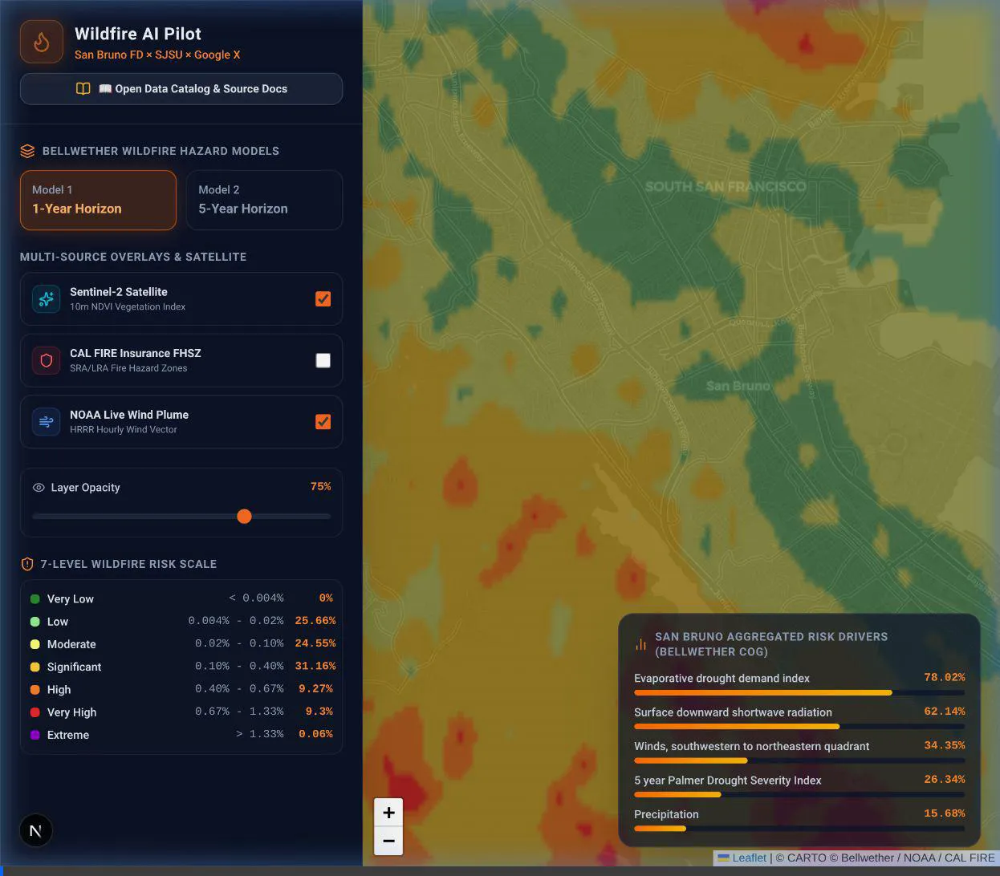

# Wildfire Risk Mitigation Pilot: San Bruno Fire Department × SJSU × Google X Bellwether

[](http://localhost:8000)
[](http://localhost:3000)
[](https://leafletjs.com/)
[](https://www.python.org/)

An interactive, multi-source geospatial AI system for wildland-urban interface (WUI) wildfire hazard modeling, dynamic risk region cropping, real-time fire/weather overlays, and **"Quantification of the Negative"** (fire department intervention valuation) calculation.

Developed under the joint collaboration between **San Bruno Fire Department (SBFD)**, **San Jose State University (SJSU WIRC & Computer Engineering)**, and **Google X's Project Bellwether**.

---

## 🎬 Live Interactive GIS Dashboard Demo



---

## ⚡ Quick Start (Local Setup)

### 1. Launch FastAPI Backend (Port 8000)
```bash
python3 -m uvicorn backend.main:app --host 0.0.0.0 --port 8000
```
- API Docs: [http://localhost:8000/docs](http://localhost:8000/docs)

### 2. Launch Next.js Frontend (Port 3000)
```bash
cd frontend
npm run dev -- -p 3000
```
- Dashboard: [http://localhost:3000](http://localhost:3000)

---

## 📖 Comprehensive Documentation Links

- 📘 **[Full Technical README & Dataset Index (src/README.md)](src/README.md)**: Contains detailed technical specs for all 10 integrated datasets, mathematical formulations, prediction principles, and student research paper roadmaps.
- 📕 **[System Walkthrough & Integration Guide (src/walkthrough.md)](src/walkthrough.md)**: Deep dive into the multi-source GIS pipeline, GCS Bellwether COG dynamic cropping, CAL FIRE perimeters, NASA FIRMS hotspots, CDEC fuel moisture, and USGS LiDAR terrain slope.
