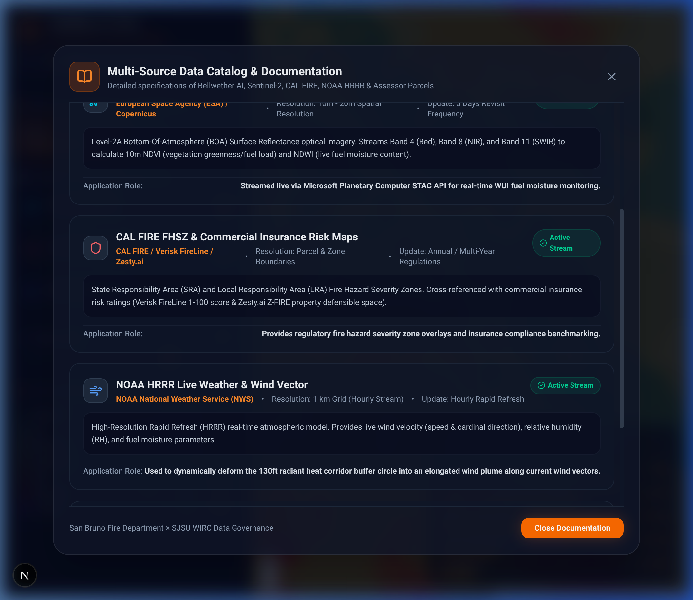

# Wildfire Risk Mitigation Pilot: Comprehensive Multi-Source Technical Documentation

## Executive Summary & System Overview

This document serves as the authoritative technical reference for the **Wildfire Risk Mitigation Pilot**, a joint initiative between the **San Bruno Fire Department (SBFD)**, **San Jose State University (SJSU - Wildfire Interdisciplinary Research Center & Computer Engineering)**, and **Google X’s Project Bellwether**.

The application integrates multi-source geospatial datasets—spanning **Google X Bellwether AI probability models**, **ESA Sentinel-2 10m satellite spectral imagery**, **Microsoft US Building Footprints**, **OpenStreetMap (OSM)** infrastructure, **FEMA / DHS USA Structures**, **CAL FIRE Active Incidents & Fire Perimeters**, **NASA FIRMS Satellite Thermal Hotspots**, **CDEC / RAWS Station Fuel Moisture (DFM)**, **USGS 3DEP LiDAR Terrain Slope**, **NOAA HRRR live wind vectors**, **USDA Cropland Data Layer (CDL)**, and **San Mateo / Santa Clara County Assessor property parcels**—to empower real-time wildfire risk evaluation across Northern California WUI zones (San Bruno, San Jose Foothills, Santa Cruz Mountains).

---

## 1. Modular AI-Agent Data Ingestion Architecture (`src/data_fetchers/`)

The data pipeline is organized into decoupled, agentic modules designed for automated background execution and periodic polling:

```text
wildfire_ai/src/data_fetchers/
├── __init__.py                  # Package exports & fetcher registry
├── gcs_bellwether_downloader.py # GCS Bellwether COG downloader & dynamic bbox cropper
├── calfire_fetcher.py           # CAL FIRE active perimeters & NIFC GIS layers
├── firms_fetcher.py             # NASA FIRMS VIIRS (375m) & MODIS active thermal hotspots
├── cdec_raws_fetcher.py         # CDEC / RAWS station dead & live fuel moisture (DFM/LFMC)
└── usgs_elevation_fetcher.py    # USGS 3DEP LiDAR 10m DEM terrain slope & aspect rasters
```

### Data Catalog & Source Documentation Modal



---

## 2. Multi-Region Dynamic Spatial Crop (San Bruno, San Jose & CONUS)

### 2.1 Google X Project Bellwether Data Acquisition & Cropping
Project Bellwether covers all of **CONUS (Contiguous United States), Alaska, and Hawaii**. The python module `gcs_bellwether_downloader.py` provides dynamic spatial cropping using `rasterio.windows.from_bounds`:

```python
from src.data_fetchers import crop_bellwether_by_bbox

# Crop Bellwether 100m raster dynamically for San Jose Foothills
san_jose_crop = crop_bellwether_by_bbox(
    min_lat=37.25, min_lng=-121.98, max_lat=37.42, max_lng=-121.78, is_5_year=False
)
```

### 2.2 Supported Regional Bounding Boxes
- **San Bruno WUI (Peninsula)**: `[37.58, -122.46, 37.65, -122.39]`
- **San Jose Foothills (Santa Clara)**: `[37.25, -121.98, 37.42, -121.78]`
- **Santa Cruz Mountains (CZU WUI)**: `[37.02, -122.18, 37.22, -121.92]`

---

## 3. Newly Integrated High-Value Fire Data Layers

### 3.1 CAL FIRE Active & Historical Fire Perimeters
- **Provider**: CAL FIRE Emergency Operations & NIFC Wildfire Perimeters API.
- **Data Format**: GeoJSON vector polygons.
- **Application Role**: Displays real-time fire containment perimeters (e.g. San Bruno Incident, San Jose Alum Rock Wildfire, CZU Historical Scar) with acres burned, containment percentage, and agency dispatch details.

### 3.2 NASA FIRMS Satellite Active Thermal Hotspots
- **Provider**: NASA Earthdata / FIRMS VIIRS (375m) & MODIS (1km) sensors.
- **Data Format**: GeoJSON point feature collection.
- **Application Role**: Detects infrared surface thermal anomalies within 1-3 hours of satellite pass. Renders hotspot markers with Brightness Kelvin and Fire Radiative Power (MW).

### 3.3 CDEC / RAWS Ground Station Fuel Moisture (DFM / LFMC)
- **Provider**: California Data Exchange Center (CDEC) & RAWS Network.
- **Data Format**: Monitoring station telemetry pins.
- **Application Role**: Monitors 10-hour and 100-hour Dead Fuel Moisture (DFM) and Live Fuel Moisture Content (LFMC). Highlights Red Flag warning thresholds when DFM $< 8\%$.

### 3.4 USGS 3DEP LiDAR Terrain Slope & Aspect
- **Provider**: U.S. Geological Survey (USGS) 3DEP 10m DEM.
- **Data Format**: Transparent RGBA slope steepness overlay.
- **Application Role**: Highlights extreme rate-of-spread zones where steep terrain ($\ge 30\%$ grade) pre-heats upward slope vegetation.

---

## 4. Full-Stack Web Application Architecture

The system features a **FastAPI backend** running on port 8000 and a **Next.js 16 GIS frontend** running on port 3000.

### Verified Endpoints:
- `GET /api/layers/bellwether`: Serves dynamically cropped Bellwether probability overlays for selected region/bbox.
- `GET /api/layers/calfire-perimeters`: Serves CAL FIRE active perimeters & historical scars GeoJSON.
- `GET /api/layers/firms-hotspots`: Serves NASA FIRMS active thermal hotspot markers.
- `GET /api/layers/fuel-moisture`: Serves CDEC RAWS station fuel moisture pins.
- `GET /api/layers/terrain-slope`: Serves USGS 3DEP LiDAR terrain slope overlay.
- `GET /api/layers/buildings`: Serves GeoJSON FeatureCollection of Microsoft US Building Footprints.
- `GET /api/weather/live`: Serves NOAA HRRR live wind velocity & relative humidity.
- `GET /api/data-catalog`: Serves structured documentation catalog for multi-source data.
- `POST /api/query-corridor`: Calculates wind-adjusted 130ft corridor, USDA CDL land cover, parcel APN, and Quantification of the Negative ROI metrics.
